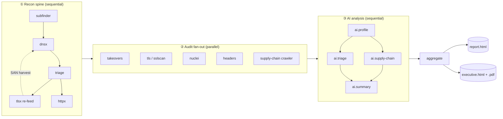
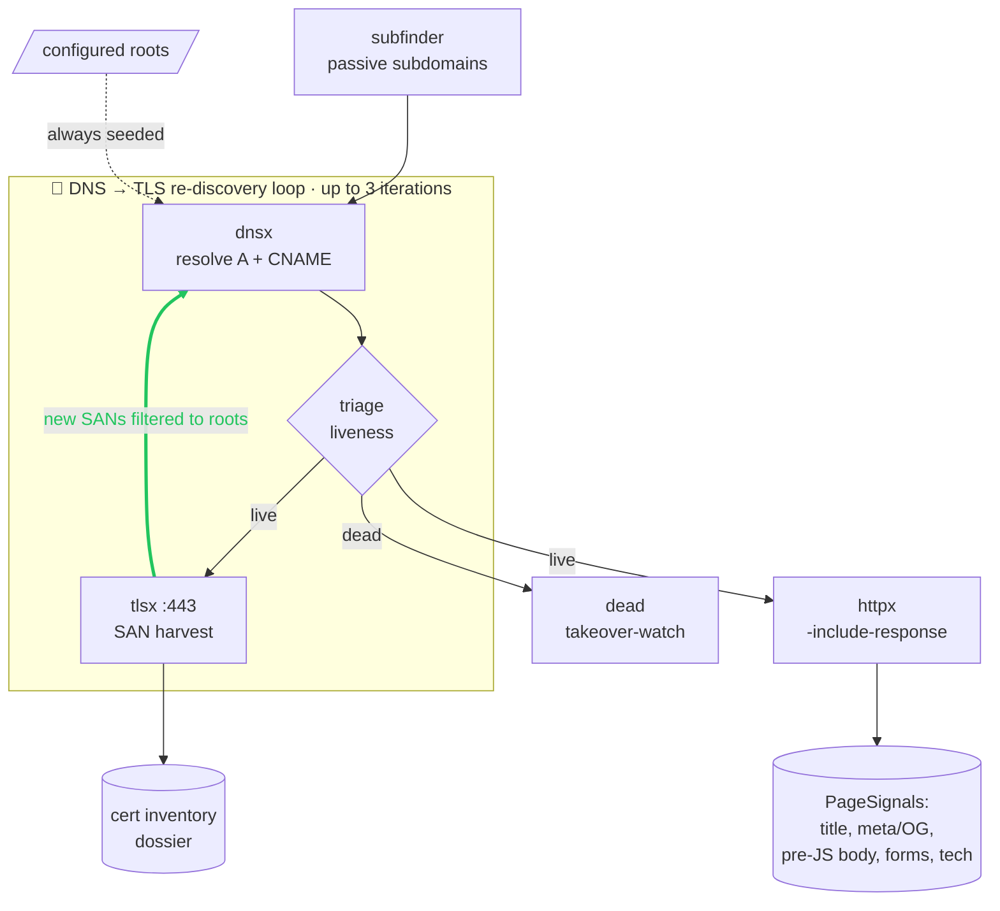
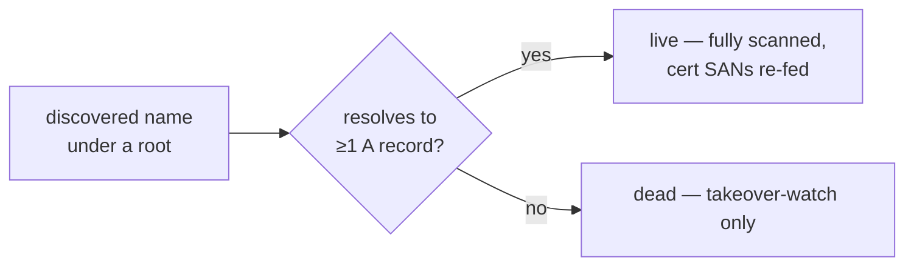
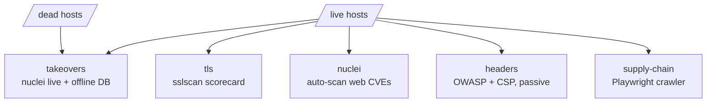
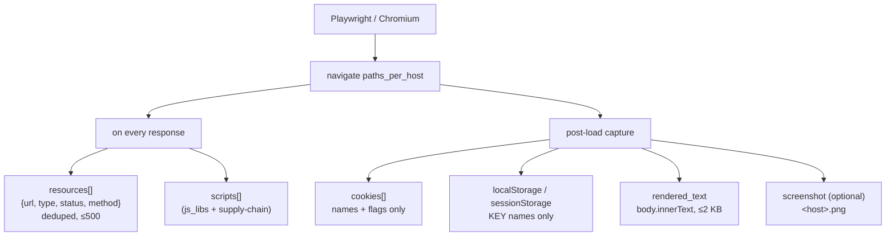
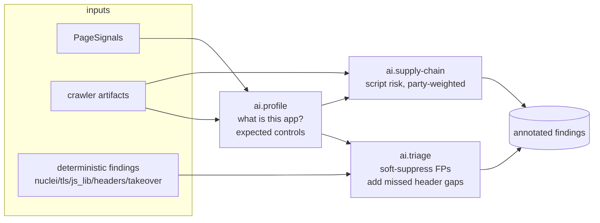
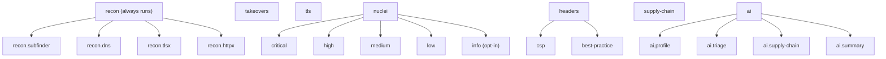
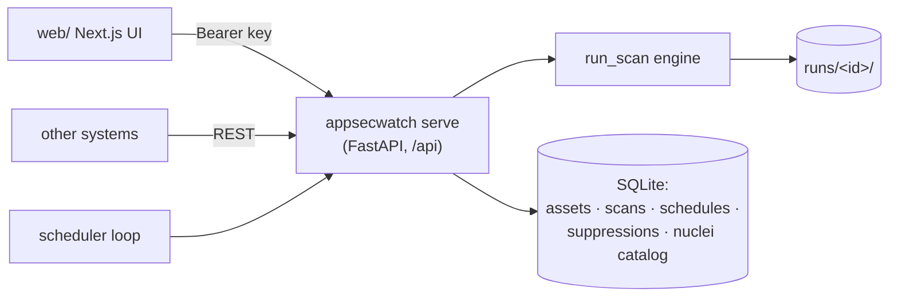

# AppSecWatch — Overview

AppSecWatch is an automated, **point-in-time, single-run** external AppSec audit
orchestrator. It runs a modular async pipeline of recon and audit tools, augments
the results with a pluggable local LLM, and renders everything into a single
self-contained HTML report. There is **no database, no delta tracking, and no
state carried across runs** — every scan produces a complete, standalone artifact
set under `runs/<id>/`.

> This file is the top-level overview and the best place to *understand how a scan
> works end to end*. **`DESIGN.md` is the canonical specification** (locked
> decisions, data model, module layout); **`API.md`** is the CLI / config / Python-API
> reference; **`WEB_API_PLAN.md`** is the HTTP-API contract; **`UI-SPEC.md`** is the
> UI design system. Where this overview and `DESIGN.md` disagree, `DESIGN.md` wins.
> Target deployment: Docker on Debian Linux.

---

## Table of contents

1. [What it is (and is not)](#what-it-is-and-is-not)
2. [The pipeline at a glance](#the-pipeline-at-a-glance)
3. [Stage 1 — Recon, scope & triage](#stage-1--recon-scope--triage)
4. [Liveness model — `live` vs `dead`](#liveness-model--live-vs-dead)
5. [Stage 2 — Audit fan-out](#stage-2--audit-fan-out)
6. [The crawler — structure-only capture](#the-crawler--structure-only-capture)
7. [Stage 3 — AI-assisted analysis](#stage-3--ai-assisted-analysis)
8. [Stage 4 — Aggregation & reporting](#stage-4--aggregation--reporting)
9. [Capabilities & selective scans](#capabilities--selective-scans)
10. [Throttle profiles](#throttle-profiles)
11. [Stealth identity (preset headers)](#stealth-identity-preset-headers)
12. [Run-directory layout](#run-directory-layout)
13. [Operability & failure signaling](#operability--failure-signaling)
14. [Deployment](#deployment)
15. [Web API & UI](#web-api--ui)

---

## What it is (and is not)

AppSecWatch answers one question per run: **"what does my external attack surface
look like right now, and what's wrong with it?"** It is a **Layer-7 AppSec tool** —
it cares whether a host *answers* and what that host *exposes*, not which network
owns the IP behind it.

| It **is** | It is **not** |
|---|---|
| A single-run, self-describing audit (`runs/<id>/` is the truth) | A continuous monitor or delta-tracker (no DB, no cross-run state in the engine) |
| Scope = the configured **`roots`** only (`under_any_root`) | An ownership classifier (no `in_scope` / `shadow_it`, no `sanctioned_cidrs`/`asns`) |
| Passive / low-touch by default (no exploitation) | A pen-test framework or active exploit runner |
| LLM-augmented, but **LLM never gates a scanner** | LLM-driven (deterministic tools always run; AI only annotates / suppresses) |

The **Web API + UI** layer (`appsecwatch/api/`, `web/`) adds a cross-run relational
layer on top — assets, schedules, suppressions, history — in SQLite. The engine
and CLI stay DB-free; only the server writes to the DB.

---

## The pipeline at a glance

A scan is a modular async pipeline. The recon spine runs first and is always a
prerequisite; the audit nodes fan out in parallel; the AI layer runs after the
audit (so it can read the crawler's rendered capture); everything is then
aggregated into one report.



Each phase only depends on the phase before it. Within the audit phase the five
nodes are independent and run concurrently (bounded by the concurrency caps). The
AI phase is gated entirely on `ai.profiling` and the `ai.*` capability tokens —
turn it off and the deterministic findings still ship.

---

## Stage 1 — Recon, scope & triage

The discovery **spine** runs sequentially. It establishes *what exists* and *what
is alive*, and feeds every downstream capability.



The thick green edge is the **re-feed loop**: every live cert's SANs (filtered to your
roots) are pushed back through dnsx, so a single seed root can fan out into the whole
reachable estate — bounded to 3 iterations to guarantee termination.

- **subfinder** — passive subdomain discovery over the configured roots.
  **Optional**: `--skip recon.subfinder` turns the scan into a quick audit of
  exactly the roots/assets you gave it (no enumeration). The required recon floor
  is `dns` + `httpx`.
- **dnsx** — resolves every candidate name (A + CNAME; IPv4 only). The configured
  roots are always seeded as candidates, so a no-subfinder scan still resolves them.
- **Triage router** — records each asset's **liveness** (see below) and attaches
  **display-only** ASN/org enrichment when an optional MaxMind MMDB is configured.
- **tlsx re-feed loop** — for live hosts it does double duty in one handshake:
  1. **SAN harvest** — pulls Subject-Alternative-Name hostnames from the live cert,
     filters them to the configured roots, and feeds new names back through dnsx +
     triage. Bounded to **3 iterations**; `*.` wildcard SANs are recorded but never
     iterated.
  2. **Cert dossier** — a passive certificate inventory (expiry, issuer, serial,
     SHA-256, self-signed / wildcard, derived in Python). Inventory only — no
     findings — surfaced in the report, `ScanResult.tls_certs`, and the UI Certs tab.
- **httpx** — isolates live web servers from the resolving set. Run with
  `-include-response`, it also yields per-host **PageSignals** (title, meta /
  OpenGraph, a pre-JS body snippet, form / password-field signals, detected tech)
  used by the AI profiler when no richer crawl is available.

---

## Liveness model — `live` vs `dead`

AppSecWatch classifies every discovered name on a **single liveness axis**. There is
deliberately *no* ownership bucketing — what matters for an L7 audit is whether a
host answers, not whose network hosts its IP.



| Status | Meaning | What runs against it |
|---|---|---|
| **`live`** | Resolves to ≥1 A record | The full audit fan-out; its cert SANs feed the DNS→TLS re-discovery loop |
| **`dead`** | NXDOMAIN or no A record (e.g. a dangling `CNAME`) | Only the **offline** subdomain-takeover check |

`ScanState` exposes `live()` / `dead()`. The configured **roots are the only scope**
(`under_any_root`) — every name resolving under a root is scanned regardless of
hosting. ASN/org is enrichment via an *optional* `mmdb_path`; omit it and assets
simply show no ASN column (it never gates a scan).

---

## Stage 2 — Audit fan-out

Five independent capabilities run in parallel against the live set.



- **Takeovers** — two halves:
  - *Live half*: hosts whose CNAME chain leaves the roots (a third-party CNAME) are
    checked with `nuclei -t http/takeovers/` (these need a resolving host that
    serves an unclaimed-page fingerprint).
  - *Dead half*: the dangling / NXDOMAIN class is matched **offline** against a
    bundled provider-fingerprint DB (`data/takeover_fingerprints.json`, from
    can-i-take-over-xyz) over the stored CNAME chain — a class nuclei structurally
    can't reach. Both emit `source='takeover'`; offline matches carry
    `check_id=takeover.<service>`.
- **TLS** — `sslscan` against every live HTTPS server, projected to a per-host
  **pass/fail scorecard**: insecure protocols disabled (SSLv2/3, TLS 1.0/1.1); no
  weak ciphers (RC4 / 3DES / DES / EXPORT / NULL / MD5 / anonymous / `<112`-bit);
  cert valid and `>30d` from expiry; key strength (RSA ≥ 2048 / EC ≥ 256); signature
  algorithm not SHA-1 / MD5; secure renegotiation. **Passive** — no ROBOT/CCS/attack
  probes — so it doesn't trip the WAFs that blocked the old sslyze path. Raw XML is
  kept per host (`source='sslscan'`). HSTS lives under `headers`, not here.
- **Web CVEs** — `nuclei` (auto-scan limits templates to detected tech) against
  live web servers. Severities, tags, template IDs and rate limit are all
  configurable.
- **Security headers** (`headers`) — a deterministic, **passive** analysis of the
  response headers httpx already captured (no new requests): the OWASP best-practice
  catalog (HSTS, clickjacking, `nosniff`, Referrer-/Permissions-Policy, cookie flags,
  info-disclosure, deprecated `X-XSS-Protection`, cross-origin isolation) plus a
  structured **CSP** weakness pass. Emits first-class findings (sources
  `headers` / `csp`), each with a stable `check_id`.
- **Supply chain** — the Playwright/Chromium crawler (detailed next).

---

## The crawler — structure-only capture

The `supply-chain` capability opens each live host in a **real headless Chromium**
(via Playwright) and records what the page actually loads and stores. It captures a
**structure-only manifest** — one JSON artifact per host — and, optionally, a
screenshot.



**The hard rule: structure only — never values, never bodies.** No cookie values,
no storage values, no response/request bodies. `runs/<id>/` and `report.html` are
designed to be **shared and emailed**; capturing a session token or PII would turn a
scan artifact into a credential-leak vector. Concretely, the artifact carries:

| Field | What it holds | Cap |
|---|---|---|
| `resources[]` | every response: `{url, type, status, method}` (deduped by URL) | ≤ 500 |
| `scripts[]` | script-response URLs (kept for `js_libs` + supply-chain) | — |
| `cookies[]` | `{name, domain, path, secure, http_only, same_site, expires}` — **no `value`** | — |
| `local_storage_keys` / `session_storage_keys` | **key names only** | — |
| `rendered_text` | `document.body.innerText`, whitespace-normalized | ≤ 2 KB |
| `screenshot` | filename of a per-host PNG (`tools.playwright.screenshot`, default on) | viewport, not full-page |

`audit/surface.py::curated_surface()` projects an artifact into a names-only blob
`{third_party_domains, script_domains, endpoints, cookie_keys, storage_keys}` (query
strings dropped, party split via `tldextract`). This is the **single source** reused
by both the AI profiler's summary and the per-asset **EASM surface** persisted on the
assets table (UI: a row's *Details → Surface / connections*). Screenshots are
**dashboard-only** — served by the API, shown in that panel, and **never** inlined
into the portable `report.html` or sent to the LLM. Two side effects also run inside
the crawl: **`js_libs`** (a retire.js-style URL match over the captured scripts,
`source='js_lib'`) and the script feed for AI supply-chain analysis.

---

## Stage 3 — AI-assisted analysis

The AI layer's distinguishing value is **per-application context awareness**. It
runs *after* the audit fan-out — specifically the profiler runs at the **head of the
AI phase** so it can read the crawler's rendered capture.



- **Profiling pass** (`ai.profile`, on by default) — infers an **`AppProfile`**: what
  the app is (login portal, API, marketing site…), its audience, sensitive
  capabilities (auth / PII / payments / upload / API), and the controls it *ought* to
  have. Input is set by **`ai.profile.render`** (`auto | always | never`, default
  `auto`, per-scan override `profile_render`):
  - **`auto`** — uses the crawler's rendered text + curated surface manifest when
    supply-chain ran for the host; otherwise falls back to httpx pre-JS PageSignals.
    Never spins up a browser *just* to profile.
  - **`always`** — force-includes the crawler (runs the browser per host) even when
    supply-chain analysis is off; coverage marks it *"forced for
    profile.render=always"*.
  - **`never`** — httpx pre-JS signals only.
- **Triage pass** (`ai.triage`) — a per-host review of **all** deterministic findings
  (nuclei / TLS / js_lib / headers / takeover). It (a) **soft-suppresses**
  false-positives across every source, and (b) adds header findings the rules miss
  (these keep `source='ai_headers'`). Suppression is gated by `ai.suppression`:
  `min_confidence` (default **medium**), a `max_severity` ceiling (default **medium**
  — findings above it are never offered to the AI, so always stay visible), and
  `require_profile` (default **false**). A suppressed finding is **hidden + uncounted
  but never deleted** (kept in `findings.json`, shown in a collapsible section).
- **Supply-chain pass** (`ai.supply-chain`) — risk reasoning over the crawler's
  scripts, each pre-labeled 1st/3rd-party **in Python** via `tldextract` (the LLM
  never decides party-ness), weighted by the profile.

**Invariant — the LLM never gates a scanner.** All AI output is Pydantic-validated
JSON with **one retry**, then graceful degradation: a host that hard-fails profiling
falls back to the default context-light prompts; a degraded analysis call is recorded
as an *error*, not a crash; and an AI degrade **suppresses nothing**, so the
deterministic findings always survive. (This is exactly why a recent kuveytturk.com.tr
scan that ran out of LLM credits still produced its full deterministic finding set —
only the AI annotations were missing.) System prompts are overridable via
`ai.prompts`; the JSON shape-hints and user-message assembly stay in code so an
override can't break the contract.

**Cost attribution.** Every LLM request is named for the provider's logs via the
`X-Title` header (`llm.app_title`, default `AppSecWatch`) and an optional
`HTTP-Referer` (`llm.app_url`). With `llm.tag_requests` on (default), the call's
purpose is appended to the title — `AppSecWatch: profile` / `: triage` / `: supply`
/ `: nuclei-gen` — so on **OpenRouter** you can see exactly which call type spent
what; on an `openrouter.ai` endpoint the OpenAI `user` field also carries the full
per-host label for per-target breakdown. The headers are ignored by backends that
don't use them, so this is harmless on local LLMs.

`llm.models` then lets each call type use a **different model** (keyed by purpose:
`profile` / `triage` / `supply` / `nuclei-gen`, falling back to `llm.model`). The
three per-host calls drive cost on a large estate, so a cheap/fast model for
profiling + supply-chain and a capable one for triage (the call that can suppress
findings) trims spend without changing anything else.

---

## Stage 4 — Aggregation & reporting

Every run produces **two** self-contained HTML documents from one shared,
themeable base (CSS / JS inlined — both survive email), plus an optional PDF:

**`report.html`** — the full **technical** report. Sections:

- **Executive summary** — a **severity histogram** with source provenance (e.g.
  `high: 8 nuclei, 4 sslscan`). No aggregate score, no letter grade.
- **Run health** — duration, error counts by stage, AI-degraded and TLS-errored
  counts, notable rate-limit / timeout events.
- **Recon** — the two liveness groups: Live (scanned) and Dead / dangling
  (takeover-watch).
- **Findings** — separate per-tool "lens" tables (nuclei, takeovers, headers, TLS…)
  — no cross-tool dedup; each finding keeps its `source`.
- **TLS scorecard** — per-host pass/fail badges + a fleet rollup.
- **Certificates** — the passive cert inventory from the recon tlsx pass.
- **AI** — profile cards plus header and supply-chain findings; suppressed findings
  in a collapsible section.
- **Run Errors** — every recorded failure (stage crashes *and* per-host failures),
  plus a collapsible **provenance** footer (tool / model versions, config hash).

**`executive.html`** — a ≤2-page **leadership one-pager**: a letterhead (org · date ·
scope · classification), a **risk posture rating** (highest severity present + a
volume note like "HIGH — 24 high findings, 18 hosts"), severity counts, scale
(DNS-live vs HTTP-responding), the **top-5 risks** in plain language, and
recommended next steps. The posture, counts, and top-risk selection are fully
deterministic; the optional `ai.summary` pass writes the narrative prose, falling
back to templated text when AI is off or degrades. Branding comes from the optional
`report:` config block. **`executive.pdf`** is rendered from it via the bundled
Chromium when `report.executive_pdf` is on (best-effort).

Both documents share a **light/dark theme toggle** (defaults to your OS preference,
remembers your choice) and a print stylesheet that forces the light, ink-friendly
palette.

---

## Capabilities & selective scans

A scan is composed of capability **tokens**. By default every capability runs; use
`--only <tokens>` to run a subset or `--skip <tokens>` to drop specific ones (the two
are mutually exclusive). The recon spine always runs as a prerequisite, and the
pipeline resolves dependencies automatically (e.g. audit nodes pull in `recon.httpx`).



The seven user-facing tokens are **`recon`, `takeovers`, `tls`, `nuclei`, `headers`,
`supply-chain`, `ai`**. Four of them split into dotted **sub-tokens** for finer
control:

| Parent | Sub-tokens | Notes |
|---|---|---|
| `recon` | `recon.subfinder`, `recon.dns`, `recon.tlsx`, `recon.httpx` | floor = `dns` + `httpx`; subfinder/tlsx optional |
| `nuclei` | `nuclei.critical \| high \| medium \| low \| info` | `info` is noisy, opt-in |
| `headers` | `headers.csp`, `headers.best-practice` | |
| `ai` | `ai.profile`, `ai.triage`, `ai.supply-chain`, `ai.summary` | `ai.triage` was formerly `ai.headers` (aliased); `ai.summary` writes the executive narrative (1 call/run, tail of the AI phase) |

A parent token expands to all its sub-tokens (back-compat). The token→stage mapping
and dependency resolution live in `stages/capabilities.py` + `stages/pipeline.py`.
A **coverage manifest** (`manifest.json`) records what ran vs. was skipped (and why);
a parent is marked `partial` when only some sub-steps ran, and skipped report sections
show a "Not run in this scan" placeholder rather than a misleading empty table. The
New-Scan UI exposes presets (Full audit, Quick, Recon only, TLS + headers) that map
onto these tokens.

---

## Throttle profiles

A single nmap-style **`throttle`** tier sets conservative rates and concurrency across
**all** network-touching tools at once. Any explicit per-tool value in the YAML
overrides the profile. The default is **`normal`** (which equals every tool's own
default, so an unset throttle reproduces prior behavior exactly).

> **httpx `threads` is the dominant block trigger** against WAF'd targets. A 50-thread
> burst at a bank's few IPs trips temporary source-blocking — httpx returns 0 live
> while tlsx still works. If a hardened target returns 0 live servers, **drop to
> `gentle`** (this, not the stealth headers, is the real anti-block lever).

| Tier | httpx rl / threads | nuclei rl | takeovers rl | dnsx rl | tlsx conc | sslscan timeout | conc default/tls/playwright |
|---|---|---|---|---|---|---|---|
| **paranoid** | 2 / **1** | 2 | 2 | 50 | 5 | 900 s | 1 / 1 / 1 |
| **gentle** | 10 / **2** | 10 | 10 | 100 | 20 | 600 s | 3 / 2 / 2 |
| **normal** *(default)* | 100 / **10** | 100 | 50 | 1000 | 100 | 300 s | 10 / 5 / 5 |
| **aggressive** | 500 / **50** | 500 | 150 | 5000 | 300 | 180 s | 20 / 10 / 8 |
| **insane** | 1000 / **200** | 1000 | 300 | 10000 | 500 | 120 s | 40 / 20 / 15 |

- **paranoid** — ~serial, tiny rates, long waits. Maximum stealth vs hardened / WAF'd
  targets.
- **gentle** — low rates + httpx threads 2. The safe choice for hardened targets that
  block bursts.
- **normal** — balanced; the default.
- **aggressive** — high concurrency for targets you fully control.
- **insane** — fastest and loudest; **will** trip WAFs.

The API's `/capabilities` endpoint returns `throttle_details` (the per-tier knob
summary) so the UI can show exactly what each tier does.

---

## Stealth identity (preset headers)

> **For AUTHORIZED testing of your own assets.** This presents a coherent browser
> identity to defeat naive UA/header WAF rules. It does **not** defeat TLS/JA3
> fingerprinting or IP-reputation — for those, get the scanner IP allowlisted. The
> crawler's real Chromium fingerprint is the genuinely stealthy surface.

`identity.preset` bundles a coherent browser UA + headers + locale, injected into
**httpx** (`-H`), **nuclei** (`build_nuclei_cmd`), and the **Playwright crawler**
(browser-context UA / headers / locale). `user_agent` / `headers` / `locale` override
or extend the preset (decoys like `X-Forwarded-For` go in `headers`). The default is
**`chrome-win`** — every scan presents a Chrome-on-Windows identity unless set to
`off`. Takeovers are excluded (they hit third-party services, not the target).

| Preset | User-Agent (abridged) | Platform hint | UA Client Hints |
|---|---|---|---|
| **`chrome-win`** *(default)* | `…Chrome/149.0.0.0 Safari/537.36` (Windows NT 10.0) | `"Windows"` | low-entropy only |
| **`chrome-mac`** | `…Chrome/149.0.0.0 Safari/537.36` (Intel Mac OS X 10_15_7) | `"macOS"` | low-entropy only |
| **`firefox`** | `…rv:140.0 Gecko/20100101 Firefox/140.0` | — | none (Firefox has no UA-CH) |
| **`off`** | each tool uses its own default UA | — | no injected headers / referrer |

**Client-hint policy (why some headers are deliberately omitted).** Chrome presets
ship only the **low-entropy** client hints a real browser sends on a cold first
request — `Sec-CH-UA`, `Sec-CH-UA-Mobile`, `Sec-CH-UA-Platform`. The **high-entropy**
hints (`Sec-CH-UA-Arch`, `-Bitness`, `-Full-Version-List`, `-Platform-Version`,
`-Model`, `-Form-Factors`, `-Wow64`) and the Google-proprietary `x-client-data` /
`x-browser-*` are **omitted on purpose**: a browser only sends those *after* the
server opts in via `Accept-CH`, so sending them unsolicited is itself a bot tell.

**Referrer rotation + Sec-Fetch coherence.** A browser preset rotates a plausible
`Referer` per `effective_headers()` call (i.e. once per tool run — httpx, nuclei, and
the crawler each get an independent referrer) from a 10-entry **`REFERER_POOL`** of
external search/social origins:

```
google.com · google.com.tr · bing.com · duckduckgo.com · search.yahoo.com
yandex.com.tr · facebook.com · linkedin.com · t.co · reddit.com
```

Because all pool entries are external origins, the coherent `Sec-Fetch-Site` is
**`cross-site`** (a click in from a search engine / social site — *not* `none`, which
means a typed/bookmarked URL with no referrer). Per Chrome's default
`strict-origin-when-cross-origin` policy a cross-site `Referer` is the *origin only*,
which is exactly what these are. An operator can pin a fixed `Referer` via
`identity.headers` to opt out of rotation. The Chrome presets also send a coherent
`Accept` (with `avif`/`webp`/`apng` + signed-exchange), `Accept-Language` leading with
`tr-TR`, the `Sec-Fetch-*` navigation set, and `Upgrade-Insecure-Requests: 1`.

---

## Run-directory layout

Every scan writes a complete, self-describing tree under `runs/<id>/`. Top-level
files always stay uncompressed so post-run tooling can read them without unpacking;
with `--compress` (default) only the bulk per-stage subdirectories are tar+gzipped.

```
runs/<id>/
├── config.snapshot.yaml          # the exact resolved config for this run
├── versions.json                 # tool versions, model, MMDB path, appsecwatch sha
├── manifest.json                 # capability coverage: ran / skipped + reason
├── run.log.jsonl                 # always-on structured event log (incl. run_summary)
├── errors.json                   # consolidated failures: stage crashes + per-host
├── summary.json                  # end-of-run rollup — RunSummary
├── report.html                   # single-file HTML dashboard (uncompressed)
│
├── 01_recon/            (or 01_recon.tar.gz)
│   ├── subfinder.txt
│   ├── dnsx.jsonl   (+ dnsx-iter1..3.jsonl if the tlsx loop iterated)
│   ├── tlsx-iter1..3.jsonl
│   ├── triage.json
│   └── httpx.jsonl
├── 02_audit/            (or 02_audit.tar.gz)
│   ├── takeovers/nuclei-takeovers.jsonl
│   ├── sslscan/<host>.xml          # raw sslscan XML, one per host
│   ├── nuclei/findings.jsonl
│   ├── playwright/<host>.json      # crawler artifact (names only)
│   └── playwright/<host>.png       # per-host screenshot (if enabled)
└── 03_ai/               (or 03_ai.tar.gz)
    ├── profile/<host>.json         # AppProfile (omitted when ai.profiling: false)
    ├── headers/<host>.json
    └── supply_chain/<host>.json
```

---

## Operability & failure signaling

- **Selective scans** — `--only` / `--skip` take the capability tokens above. The
  coverage manifest records what ran vs. was skipped and why.
- **Logging & observability** — an always-on structured `run.log.jsonl`, plus a
  pluggable terminal view: `--progress plain` (default), `rich` (live stage tree +
  warnings panel + summary; falls back to plain on a non-TTY), or `quiet`. Every
  subprocess flows through `util/subproc.run_tool`, which emits `tool_timeout` /
  `tool_nonzero` / `rate_limit_signal` events and does process-group kill on
  timeout/cancel. Each run ends with a **`RunSummary`** (logged, written to
  `summary.json`, shown in the report).
- **Failure signaling** — a completed scan exits **`0`** by default even with recorded
  errors (it always emits a full artifact set). **`--strict`** exits **`3`** if any
  failure was recorded — for CI / programmatic callers.
- **Provenance** — tool versions, nuclei template SHA, MMDB build epoch, model + base
  URL, and timestamps are captured per run (`versions.json`).

---

## Deployment

Docker-only. The image is **multi-stage and layer-cached**: deps install in layers
keyed only on `pyproject.toml` / `package-lock.json`, and the source is copied
**last** with BuildKit cache mounts — a code edit rebuilds in ~10 s (no dep reinstall
or Chromium re-download). It pins the Go binaries (subfinder, dnsx, tlsx, httpx,
nuclei), sslscan, Playwright + Chromium, and the Python deps.

> Tool flags must match the **pinned** binary versions — e.g. tlsx 1.1.7 has no `-rl`
> (its pacing knob is `-c` → `TlsxConfig.concurrency`). Verify flags against the binary
> in the image, not from memory.

A MaxMind GeoLite2-ASN MMDB can be **bind-mounted** to enable ASN/org enrichment, but
it is **optional** — scans run without it. `appsecwatch verify-deps` checks the
toolchain, Python modules, and (optionally) the MMDB + LLM endpoint before a run.

See **`API.md`** for the full CLI (`scan`, `serve`, `init-config`, `verify-deps`), the
YAML config schema, the run-directory layout, and the Python API.

---

## Web API & UI

AppSecWatch can also run as an authenticated HTTP service exposing the same engine to
other systems and to a web UI.



- **`appsecwatch serve -c server.yaml`** — a FastAPI app shipped in the same image
  (`pip install '.[web]'`). It reuses the async runner **in-process** with an injected
  `run_dir` + shared `ScanState` for live progress, keeps `runs/` as the durable
  record, and rebuilds its job index from disk on startup. Endpoints include
  `POST /scans`, `GET /scans[/{id}]`, `/scans/{id}/{result,report,log}`,
  `POST /scans/{id}/cancel`, `/healthz`, `/capabilities`, `GET`/`PUT /config`, the
  assets / schedules / suppressions / nuclei-catalog CRUD, plus OpenAPI at `/docs`.
- **Config is UI-managed and primary** — `serve -c` only *seeds* first boot; a writable
  JSON store is the source of truth and can be edited at runtime (`PUT /config` mutates
  the live config in place, so the next scan uses it with no restart). The whole scan
  config is editable; `llm.api_key` persists in the store (write-only — masked on GET).
- **No scan-target allowlist** — the per-request `roots` is the only scope. A scan is
  gated at submit on a *valid* base config (LLM endpoint; MMDB is optional) →
  `409 not_configured` until set. With auth **OPEN** (no `APPSECWATCH_API_KEYS`) there
  is **no** server-side scope ceiling, so keep API keys set before exposing it.
- **SQLite** (`<output_root>/appsecwatch.db`) is the cross-run relational layer
  (server-only; engine + CLI stay DB-free): `assets` (FQDN-keyed inventory with
  liveness, profile, finding counts, EASM surface), `scans` (history index),
  `schedules`, `suppressions`, and the nuclei template catalog / custom templates.
  Asset enrichment, per-host screenshots (`GET /assets/{fqdn}/screenshot`), scheduling
  (friendly hourly/daily/weekly cadence), scan templates, and manual cross-run
  suppression all live here.
- **`web/`** — a Next.js 16 / React 19 / Tailwind v4 UI (the AppSecMan design system)
  over that API: dashboard, scans list, a new-scan form, a live scan detail view, the
  Assets / Suppressions / Schedules / AI-Tuning / Settings pages, and an in-app docs
  page. It must stay **static-export-safe** so FastAPI can serve the built `out/` from
  one image.
- **Single image** — the `Dockerfile` statically exports the UI and `appsecwatch serve`
  serves it at `/` with the API under `/api` (same origin). One `docker run … serve`
  ships both; the UI can also run standalone against a remote API.

See **`WEB_API_PLAN.md`** for the full contract, `example.server.yaml` for a sample
server config, and `web/README.md` for the UI.
